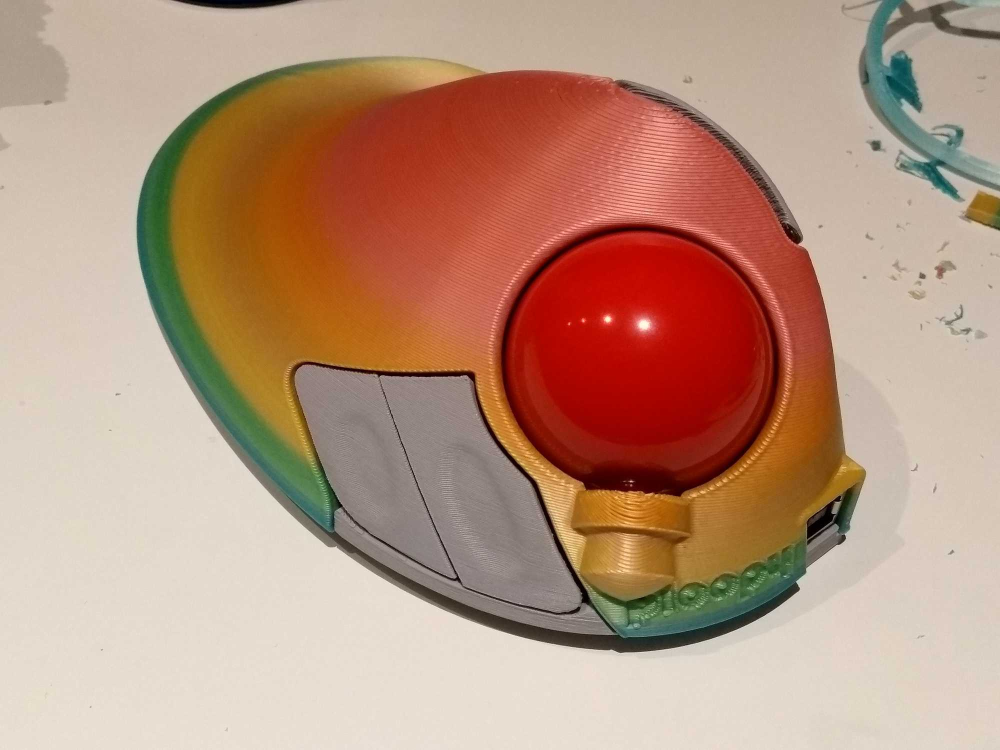
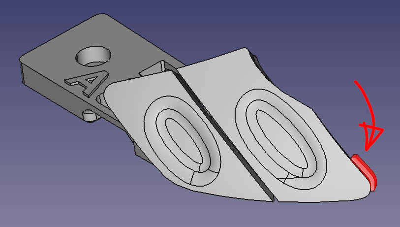

# Ploopy BTU Mod

The roller bearings used in the Ploopy Trackball are nice, but with the standard ball they might not feel as smooth or as low-friction as you'd like. The prompt for this mod was "what if we replaced them with ball transfer units?"

It turns out - good things happen!

Ball transfer units (or BTUs) are omnidirectional bearings, as opposed to the single-direction roller bearings the Ploopy Trackball uses by default. This means you're never rolling the ball in the "wrong direction" for one of them.

This mod is a new 3D-printable top piece for the Ploopy which contains holes for ball transfer units instead of roller bearings.

Designer: [George Bryant](https://github.com/gbrnt) with help and bearing advice from [/u/d4baller](https://reddit.com/user/d4baller)
## Versions
### REVD-BTU
This version is the version you should use if you have a REV D Ploopy top.
You can check this on the underside of your original top - there should be a large letter D,
and your screws will be self-tapping screws.
It supports both the original ball and the new larger (45mm) ball.

### REVC-BTU
This version is the version you should use if you have a REV C Ploopy top.
You can check this on the underside of your original top - there should be a large letter C,
and your screws will be M3 screws.
It supports both the original ball and the new larger (45mm) ball.

### v3 and v4
These versions are too small to fit the new larger ball.
They've been removed, but you can still find them in the commit history.
v3 is a non-editable version that exposes the edge of one BTU, and v4 is an editable FreeCAD version.
Here's what they look like:

## Buying the BTUs
The particular BTU this mod is designed for is the Bosch-Rexroth R053010810, or KU-B8-OFK. A set of three is about 20-30 USD, depending on where in the world you are and where you buy them from. Here are some sources we've found so far:

* [Bosch-Rexroth](https://www.boschrexroth.com/en/xc/products/product-groups/linear-motion-technology/ball-transfer-units-and-tolerance-rings/ball-transfer-units/r0530-with-sheet-steel-housing/r0530-1-with-sheet-steel-housing) - UK and worldwide, but requires you to be a company (e.g. have a VAT number)
* [Livhaven](https://store.livhaven.com/r053010810-bosch-rexroth-ball-transfer-unit) - US-based. Doesn't require company information, but overseas shipping is expensive.
* [Uberbearings](https://www.uberbearings.com/R053010810KU-B8-OFK-BOS) - Ships from UK worldwide to private customers. Much cheaper shipping than the other Europe based ones.
* [L-System](https://l-system.nu/webshop/linear-technology/ball-transfer-units-and-tolerance-rings/ball-transfer-units/type-r0530/ball-transfer-unit-ku-b8-ofk/) - Sweden-based. Might allow private customers to buy.
* [Spareparts](https://www.sp-spareparts.com/en/p/r053010810-bosch-rexroth) - Ireland-based. Ships to UK and maybe elsewhere. Does sell to private customers.
* [Rodivago](https://rodavigo.net/es/p/bola-transportadora-con-carter-de-metal-laminado-ref-053010810/557053010810) - Spain-based. May require being a company.
* For other sources, try Bosch-Rexroth's [contact locator tool](https://addresses.boschrexroth.com/) - find a distributor near you, and search for the bearing part number on their website.

(Some people consider buying cheaper nylon BTUs. But they have high internal friction and the ball actually slides on them like on a static bearing, which makes them pointless.)

## Printing
Follow [Ploopyco's recommendations for print settings](https://github.com/ploopyco/trackball/wiki/Appendix-B%3A-3D-printed-parts). It's also highly recommended to enable support interface and splitting the support into chunks, as otherwise it can be very hard to remove.

## Assembly
* Remove all support material from the print.
* Inspect the holes the BTUs will sit in to make sure there are no lumps inside the hole. File/sand/cut them off if needed.
* Install the BTUs by pushing them into the holes.
* Check the BTUs are fully installed by putting the ball on top. It shouldn't scrape on the top surface. If it did one or more of the BTUs might not be fully pushed in.
* Check that the holes for the threaded inserts are clear (You could carefully drill them out with a 4mm drill bit).
* Install 4 M3 threaded inserts into the bottom of the part using a soldering iron (see note below).
* Remove the original top piece from your Ploopy trackball.
* Remove the secondary button piece, grind off the stop (see below) and reinstall.
* Install the new top piece on the trackball.
* Give it a try!

### Threaded inserts (Ignore if using REV D)
You'll need 4 heat-set M3 threaded inserts for the screws which attach the top to the base.
These can be bought from a variety of sources - you should use ones which are made for 4.0 - 4.2mm holes.
Recommendations for installing these are in the [Ploopy trackball assembly guide](https://github.com/ploopyco/trackball/wiki/Ploopy-Trackball-Kit-Assembly).

### Modifying secondary buttons
There is a small tab on the secondary buttons which collides with the closest BTU. It needs to be sanded, filed or cut off. It is indicated in red in the image below:

