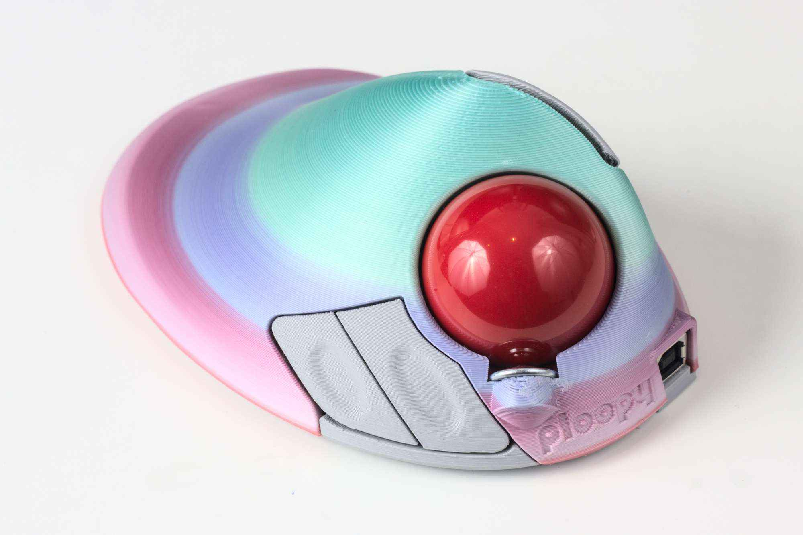

# Ploopy BTU Mod

The roller bearings used in the Ploopy Trackball are nice, but with the standard ball they might not feel as smooth or as low-friction as you'd like. The prompt for this mod was "what if we replaced them with ball transfer units?"

It turns out - good things happen!

Ball transfer units (or BTUs) are omnidirectional bearings, as opposed to the single-direction roller bearings the Ploopy Trackball uses by default. This means you're never rolling the ball in the "wrong direction" for one of them.

This mod is a new 3D-printable top piece for the Ploopy which contains holes for ball transfer units instead of roller bearings.

Designer: [George Bryant](https://github.com/gbrnt) with help and bearing advice from [/u/d4baller](https://reddit.com/user/d4baller)

## Versions
### v3
This version was designed in Rhino and so isn't really editable for most people. It works well though.

### v4
This version was redesigned in FreeCAD and the various dimensions are now editable in the FreeCAD file.

Currently untested! It might collide with something internally, particularly if you've soldered in a programming header for the microcontroller.

## Buying the BTUs
The particular BTU this mod is designed for is the Bosch-Rexroth R053010810, or KU-B8-OFK. A set of three is about 20-30 USD, depending on where in the world you are and where you buy them from. Here are some sources we've found so far:

* [Bosch-Rexroth](https://www.boschrexroth.com/en/xc/products/product-groups/linear-motion-technology/ball-transfer-units-and-tolerance-rings/ball-transfer-units/r0530-with-sheet-steel-housing/r0530-1-with-sheet-steel-housing) - UK and worldwide, but requires you to be a company (e.g. have a VAT number)
* [Livhaven](https://store.livhaven.com/r053010810-bosch-rexroth-ball-transfer-unit) - US-based. Doesn't require company information, but overseas shipping is expensive.
* [L-System](https://l-system.nu/webshop/linear-technology/ball-transfer-units-and-tolerance-rings/ball-transfer-units/type-r0530/ball-transfer-unit-ku-b8-ofk/) - Sweden-based. Might allow private customers to buy.
* [Spareparts](https://www.sp-spareparts.com/en/p/r053010810-bosch-rexroth) - Ireland-based. Ships to UK and maybe elsewhere. Does sell to private customers.
* [Rodivago](https://rodavigo.net/es/p/bola-transportadora-con-carter-de-metal-laminado-ref-053010810/557053010810) - Spain-based. May require being a company.
* For other sources, try Bosch-Rexroth's [contact locator tool](https://addresses.boschrexroth.com/) - find a distributor near you, and search for the bearing part number on their website.

## Printing
With a speed of 50-60mm/s, support on the build plate and a layer height of 0.3mm you should get a print time of ~12.5 hours. It may be worth tweaking various settings to reduce it further.

Highly recommended to enable support interface and splitting the support into chunks, as otherwise it can be very hard to remove.

## Assembly
* Remove all support material from the print.
* Inspect the holes the BTUs will sit in to make sure there are no lumps inside the hole. File/sand/cut them off if needed.
* Install the BTUs by pushing them into the holes.
* Check the BTUs are fully installed by putting the ball on top. It shouldn't scrape on the top surface. If it did one or more of the BTUs might not be fully pushed in.
* Remove the original top piece from your Ploopy trackball.
* Remove the secondary button piece, grind off the stop (see below) and reinstall.
* Install the new top piece on the trackball.
* Give it a try!

### Modifying secondary buttons
There is a small tab on the secondary buttons which collides with the closest BTU. It needs to be sanded, filed or cut off. It is indicated in red in the image below:

